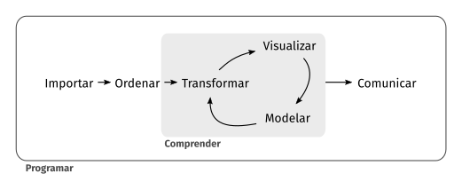

# Prerequisitos para el curso

Para realizar este curso debes tener más pasión que vocación.
Este curso está pensado para interesados en el doctorado en ingeniería industrial Di3

No necesitas saber programar, repito **NO NECESITAS** !!!

Pero si has hecho esto que aparece en la figura alguna vez en tu vida, no te preocupes ...
Has programado sin saber que esto tan simple es programar !!!

Lo realmente complicado es que vas ha tener que instalar algo de sofrware libre y tener algo de espacio en el disco para manejar datasets un poco aparatodos.
Creo realmente que este es un requisito más complicado que el de saber programar.

Utilizaremos a lo largo del curso el lenguaje R-Cran. Pero como es un tanto árido para escribir nos valdremos de otro pargrama (del tipo que se denomina IDE) llamado R-Studio.
R-Studio es un Integratede Development Envirnment o Entorno de Desarrollo Integrado que facilita mucho jugar con los datos.

La secuencia de instalación es :

1 - Instalar R-Cran que puedes bajar de https://cran.r-project.org/

2 - Instalar luego R-Studio que puedes bajar https://rstudio.com/products/rstudio/download/

Elije la versión gratuita , a menos que te estén sobrando los dólares y quieras pagar una liencia que no es muy cara.

Por favor sigue el oden de isntalación que indicamos.

			Existe un paquete para usar R-Cran desde Excel 
			(Aka usar comando de R dentro de Excel, pero hablaremos de esto en clase).

Primero, debes importar tus datos hacia R. Típicamente, esto implica tomar datos que están guardados en un archivo, base de datos o API y cargarlos como data frame en R. Si no puedes llevar tus datos a R, no puedes hacer ciencia de datos con él.

Una vez que has importado los datos, es una buena idea ordenarlos. Ordenar los datos significa guardarlos de una manera consistente que haga coincidir la semántica del set de datos con la manera en que está guardado. En definitiva, cuando tus datos están ordenados, cada columna es una variable y cada fila una observación. Tener datos ordenados es importante porque si su estructura es consistente, puedes enfocar tus esfuerzos en las preguntas sobre los datos y no en luchar para que estos tengan la forma necesaria para diferentes funciones.

Cuando tus datos están ordenados, un primer paso suele ser transformarlos. La transformación implica reducir las observaciones a aquellas que sean de interés (como todas las personas de una ciudad o todos los datos del último año), crear nuevas variables que sean funciones de variables ya existentes (como calcular la rapidez a partir de la velocidad y el tiempo) y calcular una serie de estadísticos de resumen (como recuentos y medias). Juntos, a ordenar y transformar, se les llama manejar o domar los datos, porque hacer que estos tengan la forma con la que es natural trabajarlos, suele sentirse como una lucha.

Una vez que tienes los datos ordenados con las variables que necesitas, hay dos principales fuentes generadoras de conocimiento: la visualización y el modelado. Ambas tienen fortalezas y debilidades complementarias, por lo que cualquier análisis real iterará entre ellas varias veces.

La visualización es una actividad humana fundamental. Una buena visualización te mostrará cosas que no esperabas o hará surgir nuevas preguntas acerca de los datos. También puede darte pistas acerca de si estás haciendo las preguntas equivocadas o si necesitas recolectar datos diferentes. Las visualizaciones pueden sorprenderte, pero no escalan particularmente bien, ya que requieren ser interpretadas por una persona.

Los modelos son herramientas complementarias a la visualización. Una vez que tus preguntas son lo suficientemente precisas, puedes utilizar un modelo para responderlas. Los modelos son herramientas matemáticas o computacionales, por lo que generalmente escalan bien. Incluso cuando no lo hacen, resulta más económico comprar más computadores que comprar más cerebros. Sin embargo, cada modelo tiene supuestos y, debido a su propia naturaleza, un modelo no puede cuestionar sus propios supuestos. Esto significa que un modelo, por definición, no puede sorprenderte.

El último paso de la ciencia de datos es la comunicación, una parte crítica de cualquier proyecto de análisis de datos. No importa qué tan bien tus modelos y visualizaciones te hayan permitido entender tus datos, a menos que también puedas comunicar esos resultados a otras personas.

Alrededor de todas estas herramientas se encuentra la programación. La programación es una herramienta transversal que usarás en todas las partes de tu proyecto. No necesitas ser una personas experta en programación para hacer ciencia de datos, pero aprender más sobre ella es una gran ventaja porque te permite automatizar tareas recurrentes y resolver problemas con mayor facilidad.

En cualquier proyecto de ciencia de datos tendrás que ocupar estas herramientas, pero en muchos casos estas no serán suficientes. Hay un regla aproximada de 80-20 en juego: puedes enfrentar alrededor del 80 % de cualquier proyecto usando las herramientas que aprenderás en este curso, pero necesitarás utilizar otras para abordar el 20 % restante. A lo largo del curso te iremos señalando recursos donde puedes aprender más.

## Primer referencia biblográfica que puede ayudarte.

La ciencia avanza por que se comunica

### R para Ciencia de Datos

Garrett Grolemund  Hadley Wickham

Este es el Libro Web de la versión en español de “R for Data Science”, de Hadley Wickham y Garrett Grolemund. Este texto te enseñará cómo hacer ciencia de datos con R: aprenderás a importar datos, llevarlos a la estructura más conveniente, transformarlos, visualizarlos y modelarlos. Así podrás poner en pŕactica las habilidades necesarias para hacer ciencia de datos. Tal como los químicos aprenden a limpiar tubos de ensayo y ordenar un laboratorio, aprenderás a limpiar datos y crear gráficos— junto a muchas otras habilidades que permiten que la ciencia de datos tenga lugar. En este libro encontrarás las mejores prácticas para desarrollar dichas tareas usando R. También aprenderás a usar la gramática de gráficos, programación letrada e investigación reproducible para ahorrar tiempo. Además, aprenderás a manejar recursos cognitivos para facilitar el hacer descubrimientos al momento de manipular, visualizar y explorar datos.

 Link al libro web https://es.r4ds.hadley.nz/index.html

Citas correctamente realizada
[@wickham2018r]

Todos los trabajos de evaluación que desarrollaremos serán realizados utilizando la misma tecnología de publicación que se ha utilizado en este libro.

