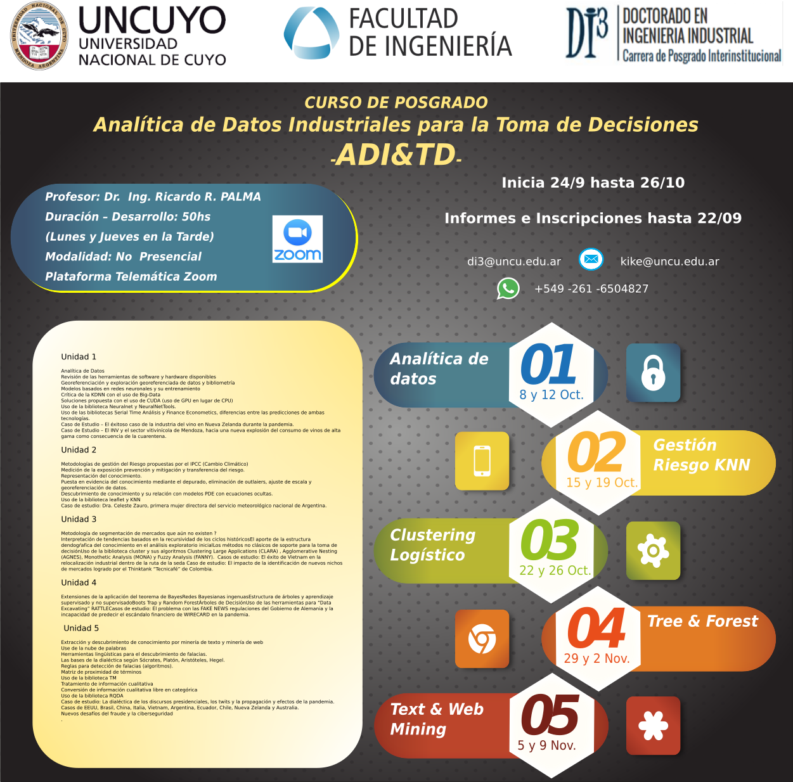

# Prefacio {-}

Di3 Doctorado Interinsititucional en Ingeniería Industrial 

* Universidad Nacional de Cuyo.
* Universidad Nacional de Misiones (Overá) 
* Universidad Nacional de Jujuy
* Universidad Nacional de Salta
* Universidad Nacional de La Rioja
* Universidad Nacional de Tucuman

